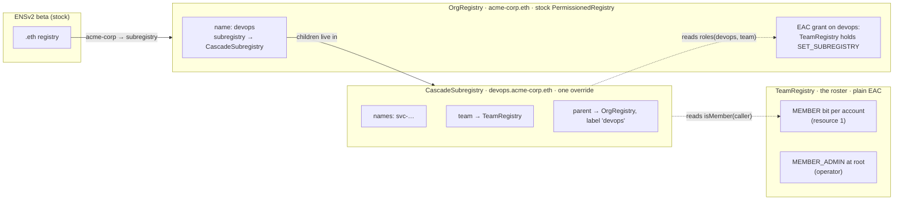
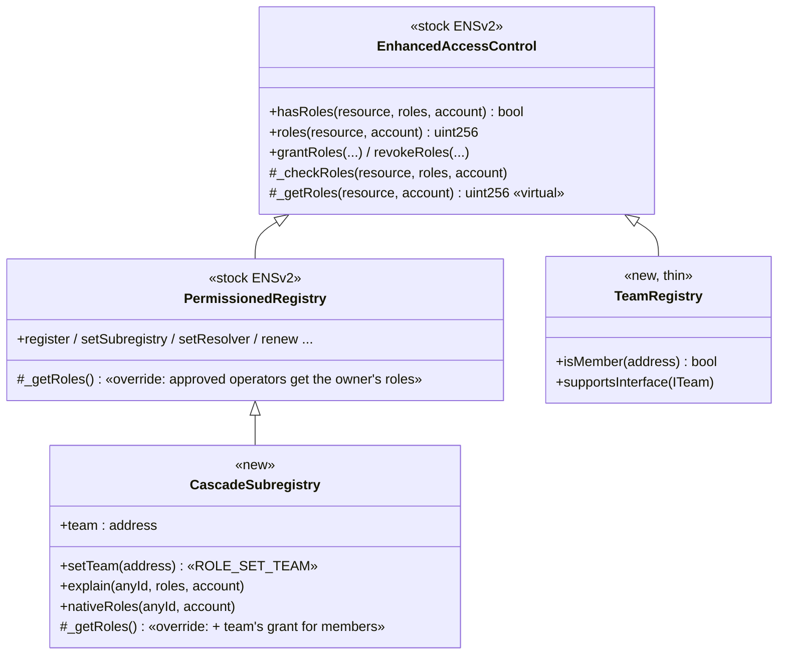
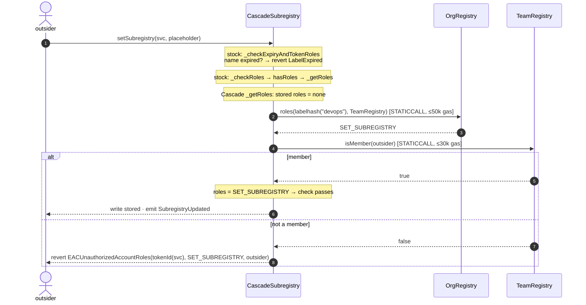
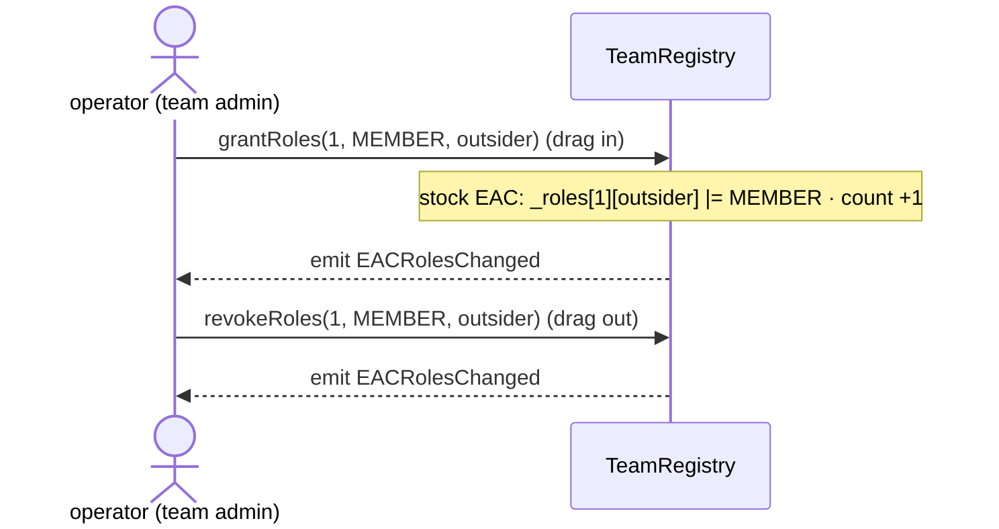
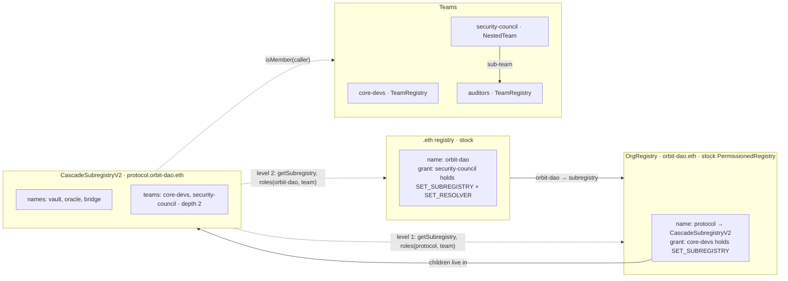

# ENS Drive — smart-contract architecture (the Cascade permission layer)

> **Naming:** *ENS Drive* is the product; *Cascade* is its permission layer — the `CascadeSubregistry` / `CascadeSubregistryV2` contracts and the ReBAC rule they implement. Contract and code names stay `Cascade…`, matching the Sepolia deployment.

**Two versions, both live.** §1–6 walk through the first, one-folder version (`CascadeSubregistry` on `devops.acme-corp.eth`, the live site's **One folder** tab and the terminal demo) call by call, because every idea in the cascade starts there. §7 is the cascade version (`CascadeSubregistryV2` on `protocol.orbit-dao.eth`), the live site's default **Cascade** tab: the same override generalised to several teams, teams of teams and several folders, with a lazy write check.

What happens at the contract level, behind every action in the demo. Diagrams render on GitHub (Mermaid). Addresses are the live Sepolia deployment on the ENSv2 beta; the source is `contracts/src/` built on `ensdomains/contracts-v2@48b3e2d`.

The demo UI shows the same thing live: after each action, its **Behind the scenes** panel replays the mined transaction with Foundry's `cast run` and prints the EVM's own call tree.

---

## 1. The contracts and what each stores



| Contract | Address (Sepolia) | Code | Stores |
|---|---|---|---|
| OrgRegistry | `0xa27742aead8ca8baa8ff0a97754ac1736741e126` | stock `PermissionedRegistry` | the name `devops`; the grant *TeamRegistry holds `SET_SUBREGISTRY` on devops*; operator's root roles |
| CascadeSubregistry | `0x2f15c12d21d7561433ddc6f7b856e9f0e4455e13` | `PermissionedRegistry` + one override | the `svc-…` names; `team` pointer; parent + label (stock `setParent`); operator's root roles incl. `ROLE_SET_TEAM` |
| TeamRegistry | `0x11ddfcb62670f0608d7cbc5b61e4470e0c7472bb` | plain `EnhancedAccessControl` | `MEMBER` on resource 1 per account; `MEMBER_ADMIN` on root for the operator |
| AlwaysTrueTeam | `0xaa735fc88e25f7d846010469ee75f287c8ec20c1` | demo fixture | nothing — answers `isMember = true` for anyone |

Three independent facts must all hold for a member to act — cut any one and access ends:
**(1)** the OrgRegistry grant to the team · **(2)** membership in TeamRegistry · **(3)** Cascade's `team` pointer.

---

## 2. Inheritance — how the override reaches ENS's own code



`_getRoles` is `virtual`, so every role check inside ENS's unmodified code (`_checkRoles`, `hasRoles`, `roles`, the grant rules) runs the most-derived version — Cascade's — which calls `super._getRoles` first (ENS's own logic) and then adds the team's grant.

```solidity
function _getRoles(uint256 resource, address account) internal view override returns (uint256 roleBitmap) {
    roleBitmap = super._getRoles(resource, account);          // stock EAC + approved operators
    if (resource == ROOT_RESOURCE) return roleBitmap;         // registry-wide roles are never inherited
    uint256 granted = _teamGrant();                           // OrgRegistry.roles(labelhash("devops"), team) & lower 128 bits
    if (granted != 0 && _isMember(account)) roleBitmap |= granted;   // TeamRegistry.isMember(account)
}
```

---

## 3. What happens on each demo action

### A write by the outsider — "Edit as outsider" → `setSubregistry(svc, placeholder)`



Real trace from the demo (replayed with `cast run`, member case):

```
CascadeSubregistry.setSubregistry(labelhash("svc-…"), placeholder)      70,230 gas
 ├─ OrgRegistry.roles(labelhash("devops"), TeamRegistry)  [read-only]  12,666 gas → SET_SUBREGISTRY
 ├─ TeamRegistry.isMember(outsider)                        [read-only]   5,148 gas → true
 ├─ emit SubregistryUpdated(tokenId("svc-…"), placeholder, outsider)
 └─ done
```

**The exact function chain** (🟦 stock ENSv2 · 🟩 Cascade · 🟨 call into another contract):

```
outsider → CascadeSubregistry.setSubregistry(svc, 0x…dEaD)                     🟦 PermissionedRegistry
├─ _checkExpiryAndTokenRoles(svc, ROLE_SET_SUBREGISTRY)                         🟦
│   ├─ _isExpired(entry.expiry)?  → revert LabelExpired
│   └─ _checkRoles(resource(svc), ROLE_SET_SUBREGISTRY, outsider)               🟦 EAC — the one check
│       └─ hasRoles → _effectiveRoles = _getRoles(ROOT) | _getRoles(svc)        🟦
│           ├─ _getRoles(ROOT, outsider)                                        🟩 → super (storage): none → ROOT: return, nothing inherited
│           └─ _getRoles(svc, outsider)                                         🟩
│               ├─ super._getRoles(svc, outsider)                               🟦 storage + approved operators: none
│               ├─ _teamGrant()                                                 🟩
│               │    └─ 🟨 OrgRegistry.roles(labelhash("devops"), TeamRegistry)  [STATICCALL ≤50k] → SET_SUBREGISTRY (admin bits masked)
│               └─ granted ≠ 0 → _isMember(outsider)                            🟩
│                    └─ 🟨 TeamRegistry.isMember(outsider)                       [STATICCALL ≤30k] → true / false
│       role present → continue · missing → revert EACUnauthorizedAccountRoles
├─ entry.subregistry = 0x…dEaD                                                 🟦 the write
└─ emit SubregistryUpdated                                                     🟦
```

**Cascade doesn't add a check — it changes the answer.** ENS's single `_checkRoles` asks "what roles does this caller have here?"; the answer comes from Cascade's `_getRoles`, which returns stored roles plus the team's grant for members. ENS compares that combined set with the needed role once.

**Why `_getRoles` is also asked about `ROOT`.** EAC combines registry-wide roles (`ROOT_RESOURCE`) with the name's own roles on every check. Cascade returns straight away for `ROOT` without adding anything, so registry-wide powers — `REGISTRAR`, `UPGRADE`, `SET_PARENT`, `ROLE_SET_TEAM`, checked with `onlyRootRoles` — are never inherited. That early return is why a member can edit files but can never create names or swap the team.

**What `_teamGrant()` returns.** One role bitmap: the regular roles the parent registry currently grants the team on this registry's own label — `parent.roles(labelhash(_childLabel), team) & lower 128 bits`, read with a capped STATICCALL. It is the same for every caller and every name in the registry; only `_isMember(caller)` depends on the caller. It returns `0` if no team is set, the parent isn't a contract, the parent is this registry (self-reference guard), the call fails or returns fewer than 32 bytes, the parent revoked the grant, or `devops` was re-issued. In the deployment it returns `0x100000` (`SET_SUBREGISTRY`). If it returns `0`, membership isn't even asked.

**Gas numbers.** Trace figures (70,230 above) are the gas used *inside* the call. Etherscan shows the whole transaction — plus the flat 21,000 per transaction and the calldata cost — so the same write reads 91,946 there.

### Joining / leaving the team — drag the outsider into / out of devops-team



Nothing is written to any name. Every subname's access flips because each check reads membership live.

### Creating a subname — "+ New file"

`CascadeSubregistry.register("svc-…", operator, 0x0, 0x0, RENEW, +30 days)` → `_register` → `LabelStore.setLabel` → `_checkRoles(ROOT, REGISTRAR, operator)` → write the record → `_mint` the name's ERC-1155 token to the operator → `_grantRoles(resource, RENEW, operator)`. Nobody gets `SET_SUBREGISTRY` on the new name.

### The attack — "As the outsider, change who the folder is shared with" → `setTeam(AlwaysTrueTeam)`

```
CascadeSubregistry.setTeam(AlwaysTrueTeam)                               3,731 gas
 └─ reverted: EACUnauthorizedAccountRoles(root, SET_TEAM, outsider)
```

`setTeam` is `onlyRootRoles(ROLE_SET_TEAM)`; it fails before anything runs. Had the caller held the role, it would also require a contract that declares `ITeam` via ERC-165, and emit `TeamPointerUpdated(old, new, by)`.

---

## 4. Role bitmaps involved

| Role | Bits | Where |
|---|---|---|
| `SET_SUBREGISTRY` | `1 << 20` | granted to TeamRegistry on `devops` in OrgRegistry; inherited by members on `svc-…` |
| `RENEW` | `1 << 16` | operator's role on each new `svc-…` |
| `ROLE_SET_TEAM` | `1 << 40` | root role on CascadeSubregistry; gates `setTeam` |
| `MEMBER` | `1 << 0` (TeamRegistry) | per member, on resource 1 |
| any admin role | `role << 128` | never inherited — Cascade masks the upper 128 bits |

---

## 5. Guarantees and where they come from

| Guarantee | Mechanism |
|---|---|
| Members can't grant or revoke | the inherited bitmap is masked to the lower 128 bits; EAC derives grant rights only from admin (upper) bits |
| Members can't register, upgrade or change the team | `_getRoles` returns early for `ROOT_RESOURCE` |
| Only the role the parent chose | `granted` is exactly what OrgRegistry holds for the team on `devops` |
| Views agree with writes | the logic lives in `_getRoles`, which `hasRoles`, `roles` and `_checkRoles` all read |
| A broken or hostile team can't block or escalate | STATICCALLs (no state changes), gas caps, length-checked returns; any failure → no inherited roles |
| Re-issuing the parent ends the team's authority | `roles()` reads the parent's *current* EAC resource; unregister/expiry moves it |
| Stored EAC state is never touched by inheritance | nothing is written on Cascade when a member gains or loses access — `nativeRoles()` stays unchanged |

---

## 6. Trade-offs (named)

- `hasRoles()` / `roles()` include inherited roles; for a member, `hasRoles()` is also true on unregistered labels (writes there still revert, `LabelExpired`).
- Inherited roles emit no events; indexers should call `hasRoles()`.
- Every role lookup on a subname can make two external calls — about 2,300 extra gas per write, native owners included (local measurement).
- The team contract itself holds `SET_SUBREGISTRY` on `devops`; `TeamRegistry` has no function that uses it — team contracts should be narrow.
- v1 scope: one hop, one team per registry (the cascade version in §7 lifts both).

---

## 7. The cascade version — `CascadeSubregistryV2` (the live demo)

`CascadeSubregistryV2` keeps the same shape — a `PermissionedRegistry` subclass, the same guarantees as §5 — and generalises the rule from one parent and one team to up to 4 teams and up to 3 levels:

```
roles = native  ∪  ⋃ over teams t, levels k ≤ depth, t.isMember(caller):  ancestor_k.roles(label_k, t) & regular bits
```

### The demo tree



| Contract | Address (Sepolia) | Stores |
|---|---|---|
| OrgRegistry (`orbit-dao.eth`) | `0x6e1d2249483700697eb92f959f629fc2ebd6fc48` | stock; the name `protocol`; the grant *core-devs holds `SET_SUBREGISTRY` on protocol* |
| CascadeSubregistryV2 (`protocol.orbit-dao.eth`) | `0x7aa120442ccb9df297d81cd88975e4d9b129d0a3` | the files `vault`, `oracle`, `bridge`; the teams list (≤ 4); `depth` (1–3); parent + label (stock `setParent`) |
| core-devs (`TeamRegistry`) | `0x170943bc913b250cb16d3e2720d0d4852e91adb0` | `MEMBER` per account |
| security-council (`NestedTeam`) | `0xce0bdedf8d6afb19c395f0d242395f62f975acfa` | its own members and its sub-teams (auditors); member if in it or in a sub-team, up to 3 levels |
| auditors (`TeamRegistry`) | `0x63941f63430acb4af79c33d2eb5d6815683b9b62` | `MEMBER` per account |

The security council's grant is on `orbit-dao.eth` itself, in the stock .eth registry — two registries above the files. Alex's names, `alex.orbit-dao.eth` (hosted demo account) and `alex-dev.orbit-dao.eth` (local), are ordinary names in the org registry. Setup and smoke transactions: [`roadmap-v2.md` §9](roadmap-v2.md#9-the-demo-tree-orbit-daoeth).

### A write by Alex, in the auditors — `setSubregistry(vault, …)`

`_checkRoles` (lazy, role-aware) runs in this order:

1. **Own roles.** Alex holds nothing stored on `vault` → keep going. (An owner stops here: no external call.)
2. **Level 1, `protocol`.** `OrgRegistry.getSubregistry("protocol")` points back to this registry ✓. core-devs' grant covers `SET_SUBREGISTRY` → `core-devs.isMember(alex)` → no. security-council's grant at this level is empty → not asked.
3. **Step up.** `getParent()` on the org registry (decoded through a self-call, so a malformed answer fails closed) → the .eth registry, label `orbit-dao`.
4. **Level 2, `orbit-dao.eth`.** `.eth registry.getSubregistry("orbit-dao")` points back to the org registry ✓. core-devs is a known non-member → skipped. security-council's grant covers `SET_SUBREGISTRY` → `security-council.isMember(alex)` → `auditors.isMemberWithin(alex, …)` → yes → covered, stop → allowed.

If nothing covers the role, ENS's own `EACUnauthorizedAccountRoles` revert fires, as for any unauthorised caller. With the switch off (`setDepth(1)`), step 3 never happens, so Alex-in-auditors is refused.

Views (`hasRoles`, `roles`, `explain`) go through `_getRoles`, which computes the full union: `hasRoles` isn't virtual in `PermissionedRegistry`, so it can't know the requested role. Because inheritance only adds roles, the lazy write check and the full union give the same yes/no; `testFuzz_lazyCheckMatchesFullUnion` and the Halmos proof `check_v2_lazyEqualsFullUnion` check it.

### What v2 adds to §5's guarantees

| Guarantee | Mechanism |
|---|---|
| A registry can't adopt a parent | each level counts only if the ancestor's `getSubregistry(label)` returns the child below it |
| Owners pay nothing extra on writes | own roles first in `_checkRoles` |
| Members pay only for paths that can help | membership asked only when a grant covers a missing role; stop when covered |
| Bounded work | ≤ 4 teams, ≤ 3 levels, `NestedTeam` ≤ 4 sub-teams × 3 levels; caps: `isMember` 100k, parent reads and link checks 50k; `getParent` return ≤ 320 bytes |
| Adding a team is guarded | `ROLE_SET_TEAM` on root, contract with `ITeam` via ERC-165, `TeamAdded` / `TeamRemoved` / `DepthUpdated` events |

**Gas (Sepolia):** a member's write via level 1 is 97,665 (full-union v2: 165,723; v1: 91,946); via level 2 and the nested team 138,289; an owner's write 36,971. Worst case for an inherited lookup (4 hostile teams, depth 3) is bounded at ~553k locally. Full detail, both deployments and evidence: [`roadmap-v2.md`](roadmap-v2.md).
