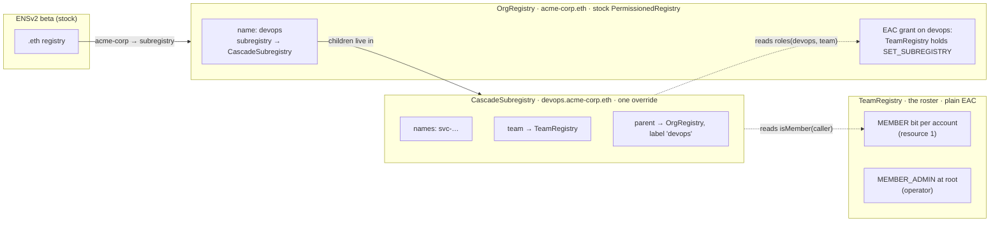
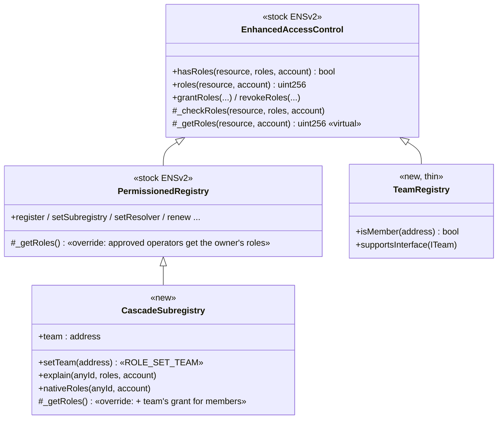
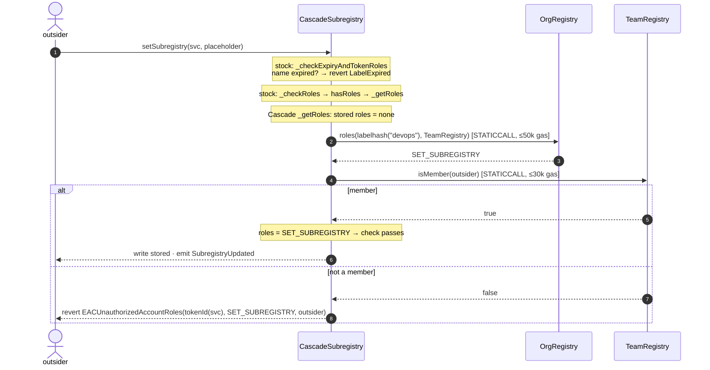
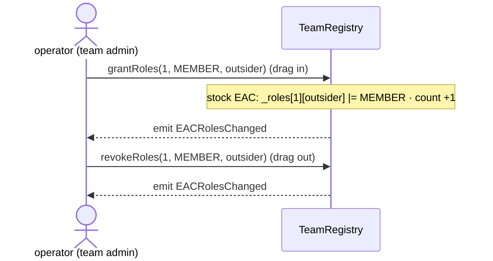

# Cascade — smart-contract architecture

What happens at the contract level, behind every action in the demo. Diagrams render on GitHub (Mermaid). Addresses are the live Sepolia deployment on the ENSv2 beta; the source is `contracts/src/` built on `ensdomains/contracts-v2@48b3e2d`.

The demo UI shows the same thing live: after each action, its **Behind the scenes** panel replays the mined transaction with Foundry's `cast run` and prints the EVM's own call tree.

---

## 1. The contracts and what each stores



| Contract | Address (Sepolia) | Code | Stores |
|---|---|---|---|
| OrgRegistry | `0xa27742aead8ca8baa8ff0a97754ac1736741e126` | stock `PermissionedRegistry` | the name `devops`; the grant *TeamRegistry holds `SET_SUBREGISTRY` on devops*; operator's root roles |
| CascadeSubregistry | `0x2f15c12d21d7561433ddc6f7b856e9f0e4455e13` | `PermissionedRegistry` + one override | the `svc-…` names; `team` pointer; parent + label (stock `setParent`); operator's root roles incl. `ROLE_SET_TEAM` |
| TeamRegistry | `0x11ddfcb62670f0608d7cbc5b61e4470e0c7472bb` | plain `EnhancedAccessControl` | `MEMBER` on resource 1 per account; `MEMBER_ADMIN` on root for the operator |
| AlwaysTrueTeam | `0xaa735fc88e25f7d846010469ee75f287c8ec20c1` | demo fixture | nothing — answers `isMember = true` for anyone |

Three independent facts must all hold for a member to act — cut any one and access ends:
**(1)** the OrgRegistry grant to the team · **(2)** membership in TeamRegistry · **(3)** Cascade's `team` pointer.

---

## 2. Inheritance — how the override reaches ENS's own code



`_getRoles` is `virtual`, so every role check inside ENS's unmodified code (`_checkRoles`, `hasRoles`, `roles`, the grant rules) runs the most-derived version — Cascade's — which calls `super._getRoles` first (ENS's own logic) and then adds the team's grant.

```solidity
function _getRoles(uint256 resource, address account) internal view override returns (uint256 roleBitmap) {
    roleBitmap = super._getRoles(resource, account);          // stock EAC + approved operators
    if (resource == ROOT_RESOURCE) return roleBitmap;         // registry-wide roles are never inherited
    uint256 granted = _teamGrant();                           // OrgRegistry.roles(labelhash("devops"), team) & lower 128 bits
    if (granted != 0 && _isMember(account)) roleBitmap |= granted;   // TeamRegistry.isMember(account)
}
```

---

## 3. What happens on each demo action

### A write by the outsider — `setSubregistry(svc, placeholder)`



Real trace from the demo (replayed with `cast run`, member case):

```
CascadeSubregistry.setSubregistry(labelhash("svc-…"), placeholder)      70,230 gas
 ├─ OrgRegistry.roles(labelhash("devops"), TeamRegistry)  [read-only]  12,666 gas → SET_SUBREGISTRY
 ├─ TeamRegistry.isMember(outsider)                        [read-only]   5,148 gas → true
 ├─ emit SubregistryUpdated(tokenId("svc-…"), placeholder, outsider)
 └─ done
```

### Joining / leaving the team — drag in / drag out



Nothing is written to any name. Every subname's access flips because each check reads membership live.

### Creating a subname — `+ New subname`

`CascadeSubregistry.register("svc-…", operator, 0x0, 0x0, RENEW, +30 days)` → `LabelStore.setLabel` → mint the name's ERC-1155 token to the operator → the operator gets `RENEW` on it. Nobody gets `SET_SUBREGISTRY` on the new name.

### The hijack attempt — dropping `AlwaysTrueTeam` on the socket

```
CascadeSubregistry.setTeam(AlwaysTrueTeam)                               3,731 gas
 └─ reverted: EACUnauthorizedAccountRoles(root, SET_TEAM, outsider)
```

`setTeam` is `onlyRootRoles(ROLE_SET_TEAM)`; it fails before anything runs. Had the caller held the role, it would also require a contract that declares `ITeam` via ERC-165, and emit `TeamPointerUpdated(old, new, by)`.

---

## 4. Role bitmaps involved

| Role | Bits | Where |
|---|---|---|
| `SET_SUBREGISTRY` | `1 << 20` | granted to TeamRegistry on `devops` in OrgRegistry; inherited by members on `svc-…` |
| `RENEW` | `1 << 16` | operator's role on each new `svc-…` |
| `ROLE_SET_TEAM` | `1 << 40` | root role on CascadeSubregistry; gates `setTeam` |
| `MEMBER` | `1 << 0` (TeamRegistry) | per member, on resource 1 |
| any admin role | `role << 128` | never inherited — Cascade masks the upper 128 bits |

---

## 5. Guarantees and where they come from

| Guarantee | Mechanism |
|---|---|
| Members can't grant or revoke | the inherited bitmap is masked to the lower 128 bits; EAC derives grant rights only from admin (upper) bits |
| Members can't register, upgrade or change the team | `_getRoles` returns early for `ROOT_RESOURCE` |
| Only the role the parent chose | `granted` is exactly what OrgRegistry holds for the team on `devops` |
| Views agree with writes | the logic lives in `_getRoles`, which `hasRoles`, `roles` and `_checkRoles` all read |
| A broken or hostile team can't block or escalate | STATICCALLs (no state changes), gas caps, length-checked returns; any failure → no inherited roles |
| Re-issuing the parent ends the team's authority | `roles()` reads the parent's *current* EAC resource; unregister/expiry moves it |
| Stored EAC state is never touched by inheritance | nothing is written on Cascade when a member gains or loses access — `nativeRoles()` stays unchanged |

---

## 6. Trade-offs (named)

- `hasRoles()` / `roles()` include inherited roles; for a member, `hasRoles()` is also true on unregistered labels (writes there still revert, `LabelExpired`).
- Inherited roles emit no events; indexers should call `hasRoles()`.
- Every role lookup on a subname can make two external calls — about 2,300 extra gas per write, native owners included (local measurement).
- The team contract itself holds `SET_SUBREGISTRY` on `devops`; `TeamRegistry` has no function that uses it — team contracts should be narrow.
- MVP scope: one hop, one team per registry.
